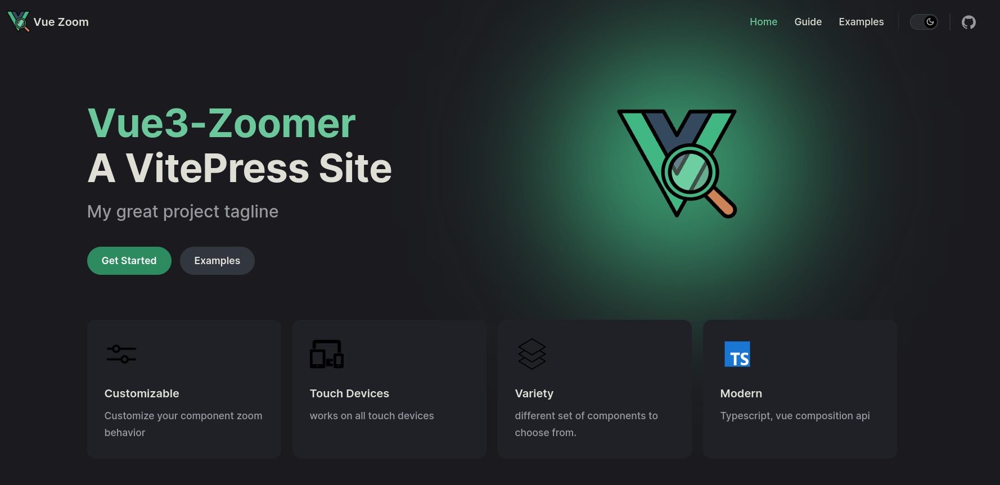

# Vue3 Zoomer

Vue3 Zoomer is a beautiful image viewer component for Vue.js projects, making it easy to create stunning zoomable images for ecommerce, art galleries, infographics, and any other image you need to zoom into.

## Why Use Vue3 Zoomer?

- **Customizable Zoom Behavior**: Choose zoom type, trigger, scale, and step to fit your specific requirements.
- **Touch Device Support**: The component works seamlessly on both desktop and mobile devices, providing a smooth zooming experience across platforms.
- **Multiple Zoom Components**: Vue3 Zoomer offers a variety of zoom components to choose from, allowing you to select the one that best fits your project's needs.
- **Typescript Support**: The component is written in Typescript, ensuring type safety and a better developer experience.
- **Easy Integration**: Vue3 Zoomer is simple to set up and use in your Vue.js and Nuxt.js projects, making it a great choice for quickly adding image zooming capabilities to your application.

## Installation

Install the package using npm or yarn:

```bash
npm install vue3-zoomer
```

## Basic Usage

First, import the `ZoomImg` component:

```ts
import ZoomImg from "vue3-zoomer";
```

Then, use the `ZoomImg` component in your template:

```html
<ZoomImg src="/image.png" zoom-type="move" :zoom-scale="3" />
```

## Props

| Name         | Type                 | Default    | Description                                                                |
| ------------ | -------------------- | ---------- | -------------------------------------------------------------------------- |
| `src`        | `String`             | `required` | The source URL of the image to be zoomed.                                  |
| `zoomScale`  | `Number`             | `2`        | The initial zoom scale of the image.                                       |
| `trigger`    | `"click" \| "hover"` | `"click"`  | The event that triggers the zoom functionality, either "click" or "hover". |
| `zoomType`   | `"move" \| "drag"`   | `"move"`   | The type of zoom interaction, either "move" or "drag".                     |
| `step`       | `Number`             | -          | The step value for the zoom scale.                                         |
| `persist`    | `Boolean`            | -          | Whether the zoom state should persist across component mounts.             |
| `showImgMap` | `Boolean`            | -          | Whether to display the image map overlay.                                  |
